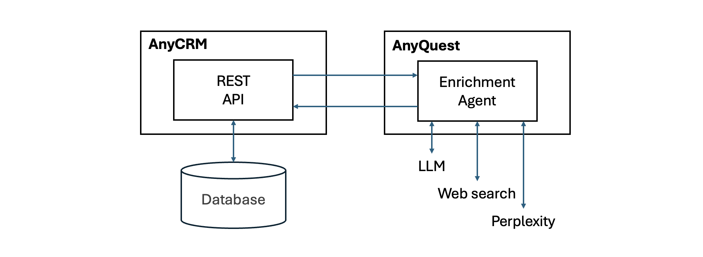
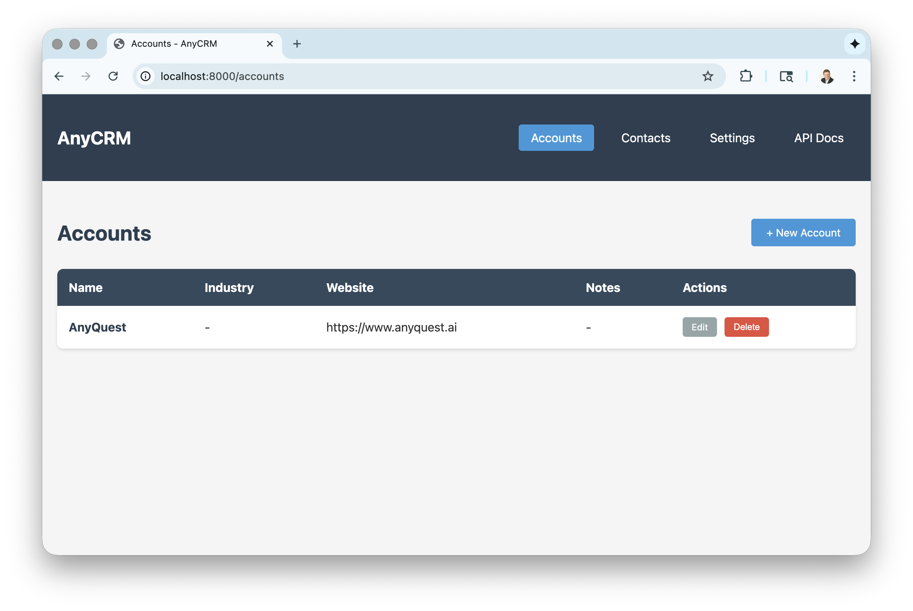

# AnyCRM

A simple, self-contained CRM application built with Python, FastAPI, SQLite, and AnyQuest. Perfect for learning how to integrate AI agents into a business application so that the application can invoke AI agents and agents can use services provided by the application. 



## Features

- **Two-table database**: Accounts and Contacts with relationship support
- **Web UI**: Clean, responsive interface for CRUD operations
- **REST API**: Full REST API with Bearer token authentication and automatic OpenAPI documentation
- **AI Agent Integration**: Account enrichment via AnyQuest AI agents with real-time WebSocket updates
- **Self-contained**: Uses SQLite - no external database required
- **Easy deployment**: Works on Replit, local machines, and cloud platforms

## Quick Start

### Prerequisites

- Python 3.8 or higher
- pip (Python package installer)
- AnyQuest account
- ngrok (optional, for creating external URLs) 

### Installation & Running

#### On Mac/Linux

1. **Clone or download this repository**
   ```bash
   git clone https://github.com/cherevik/AnyCRM.git
   cd AnyCRM
   ```

2. **Create a virtual environment** (recommended)
   ```bash
   python3 -m venv venv
   source venv/bin/activate
   ```

3. **Install dependencies**
   ```bash
   pip install -r requirements.txt
   ```

4. **Run the application**
   ```bash
   python main.py
   ```

5. **Access the application**
   - Web UI: http://localhost:8000
   - API Documentation: http://localhost:8000/docs
   - Alternative API Documentation: http://localhost:8000/redoc

#### On Windows

1. **Clone or download this repository**
   ```cmd
   git clone <your-repo-url>
   cd AnyCRM
   ```

2. **Create a virtual environment** (recommended)
   ```cmd
   python -m venv venv
   venv\Scripts\activate
   ```

3. **Install dependencies**
   ```cmd
   pip install -r requirements.txt
   ```

4. **Run the application**
   ```cmd
   python main.py
   ```

5. **Access the application**
   - Web UI: http://localhost:8000
   - API Documentation: http://localhost:8000/docs
   - Alternative API Documentation: http://localhost:8000/redoc

### Running on Replit

1. Fork or import this repository to Replit
2. Replit will automatically detect the Python environment
3. Click the "Run" button
4. The application will start and be accessible via the Replit URL

### Creating an External URL with ngrok

To make your local AnyCRM instance accessible from the internet (useful for testing webhooks, sharing with team members, or integrating with external services):

1. **Install ngrok**
   - Visit [ngrok.com](https://ngrok.com) and create a free account
   - Download and install ngrok for your operating system
   - Authenticate ngrok with your account token:
     ```bash
     ngrok config add-authtoken YOUR_AUTH_TOKEN
     ```

2. **Start your AnyCRM application**
   ```bash
   python main.py
   ```

3. **In a new terminal, create a tunnel to your local server**
   ```bash
   ngrok http 8000
   ```

4. **Access your application via the ngrok URL**
   - ngrok will display URLs like: `https://abc123.ngrok.io`
   - Use this URL to access your AnyCRM from anywhere
   - API endpoints will be available at: `https://abc123.ngrok.io/api/accounts`
   - Web UI will be available at: `https://abc123.ngrok.io`

**Note**: The free ngrok tier provides temporary URLs that change each time you restart ngrok. For persistent URLs, consider upgrading to a paid ngrok plan.


## Configuring AI Agent 

### Creating AnyQuest Workspace 

1. **Create a new workspace on AnyQuest**
   - Navigate to the Workspaces panel on AnyQuest 
   - Click on the + button in the lower right corner 
   - Enter a name for the new workspace 
   - Click Submit 

2. **Instantiate the workspace template**
   - Open the workspace by clicking on its entry in the list of workspaces
   - Click on the three dots icon in the upper right corner
   - Select Import Template in the menu 
   - Select the anycrm-template.aqt file in this project folder 

### Configuring AnyQuest Agent and AnyCRM 

1. **Configure AnyCRM API** 
   - Open AnyCRM replit URL or ngrok URL in the browser 
   - Switch to the Settings tab 
   - Enter the replit URL or the ngrok URK in the Base URL field 
   - Click Save Settings  

2. **Configure the AnyCRM tool in the workspace**
   - Select the Settings tab in the AnyQuest workspace view
   - Click on Tools in the left sidebar 
   - Click on the three dots icon in the AnyCRM row and choose Properties 
   - Enter the Replit URL or the ngrok URL in the OpenAPI Spec URL field
   - Copy the Token value from AnyCRM settings to the Token field 
   - Click Submit

3. **Configure the agent integration**
   - Select the Agents tab in the AnyQuest workspace view 
   - Select the Enrich Account agent in the list 
   - Select the Integrations tab in the agent view 
   - Click on the + button in the lower right corner 
   - Select Web API, click Continue, click Create 
   - Click Copy to copy the agent API key 

4. **Connect AnyCRM to the agent** 
   - Open AnyCRM replit URL or ngrok URL in the browser 
   - Switch to the Settings tab
   - Enter https://api.anyquest.ai in the AnyQuest API URL field 
   - Paste the agent API key in the Enrichment Agent API Key field
   - Click Save Settings 

## Project Structure

```
AnyCRM/
├── anycrm-template.aqt  # AnyQuest workspace template 
├── main.py              # Main application file with FastAPI routes
├── database.py          # Database models and initialization
├── config.py            # Configuration management
├── migrate_db.py        # Database migration script
├── requirements.txt     # Python dependencies
├── README.md           # This file
├── config.json         # Configuration file (created automatically)
├── anycrm.db           # SQLite database (created automatically)
├── templates/          # HTML templates for web UI
│   ├── base.html       # Base template with common layout
│   ├── accounts.html   # Accounts list page
│   ├── account_form.html # Account create/edit form
│   ├── account_detail.html # Account detail page with enrichment
│   ├── contacts.html   # Contacts list page
│   ├── contact_form.html # Contact create/edit form
│   └── settings.html   # Settings page
└── static/             # Static files (currently empty)
```




